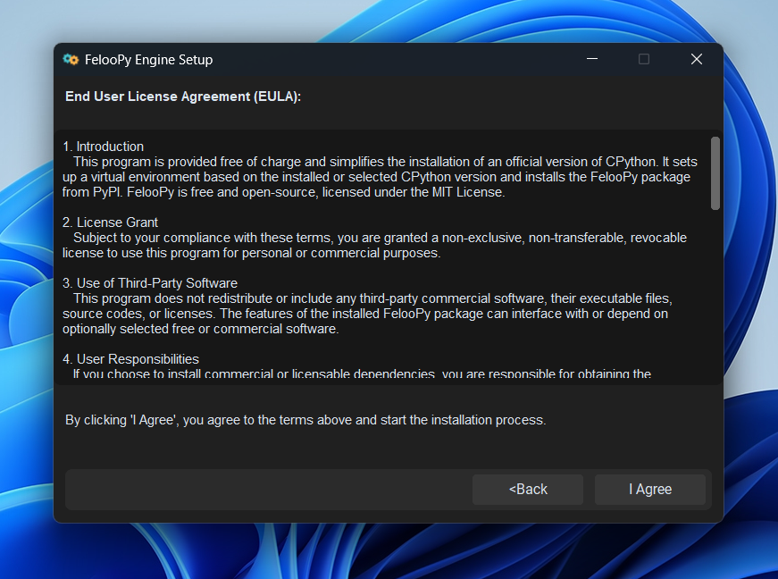
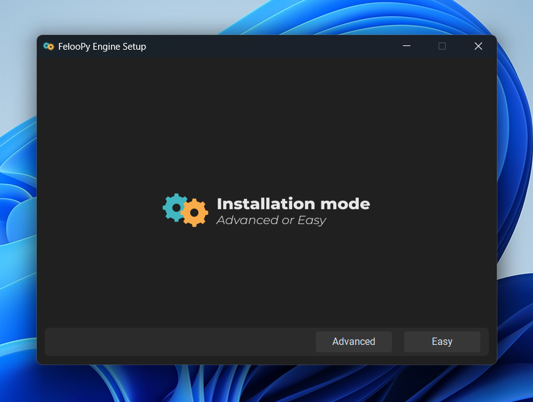
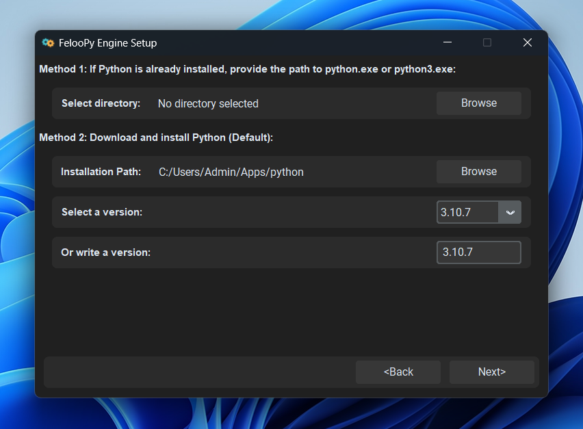
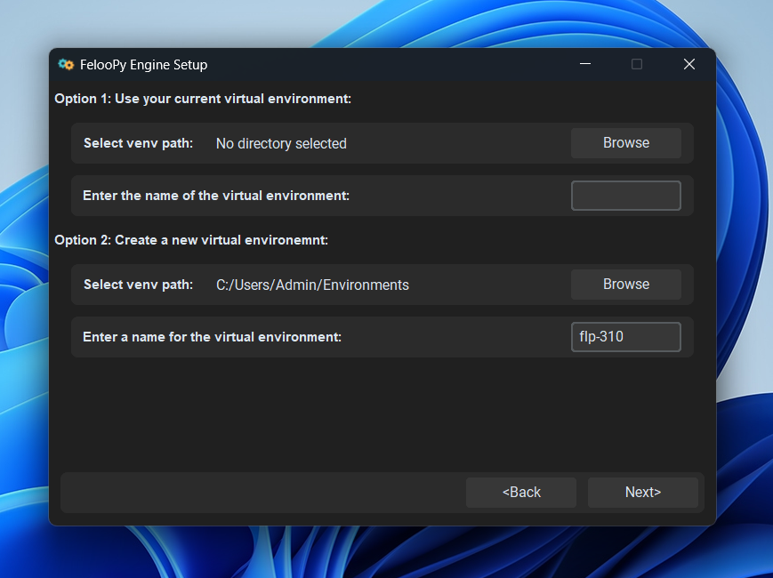
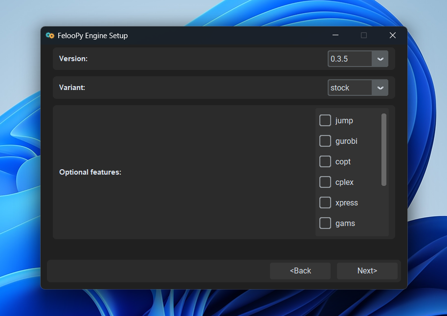
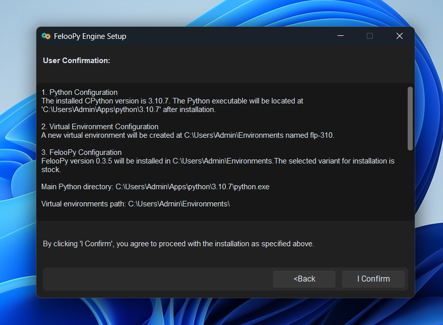
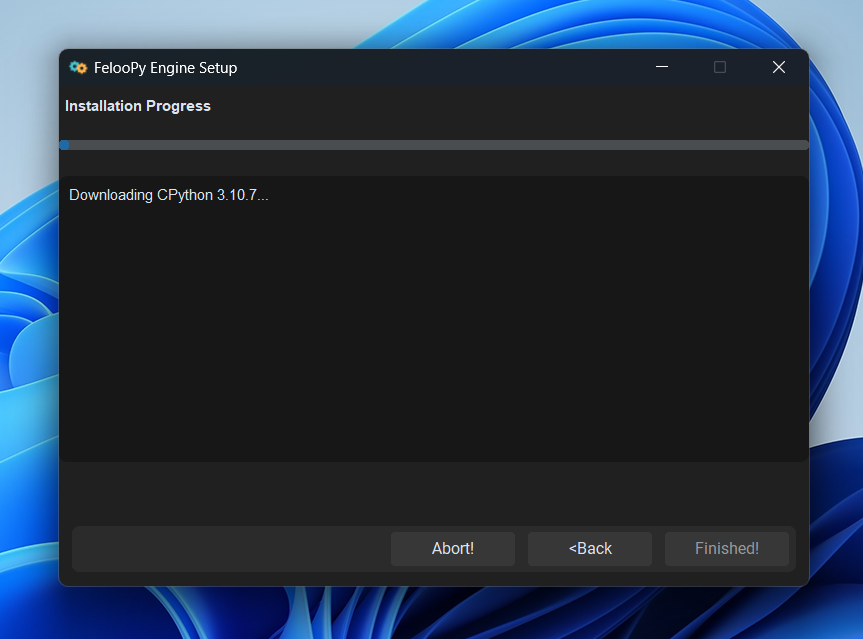
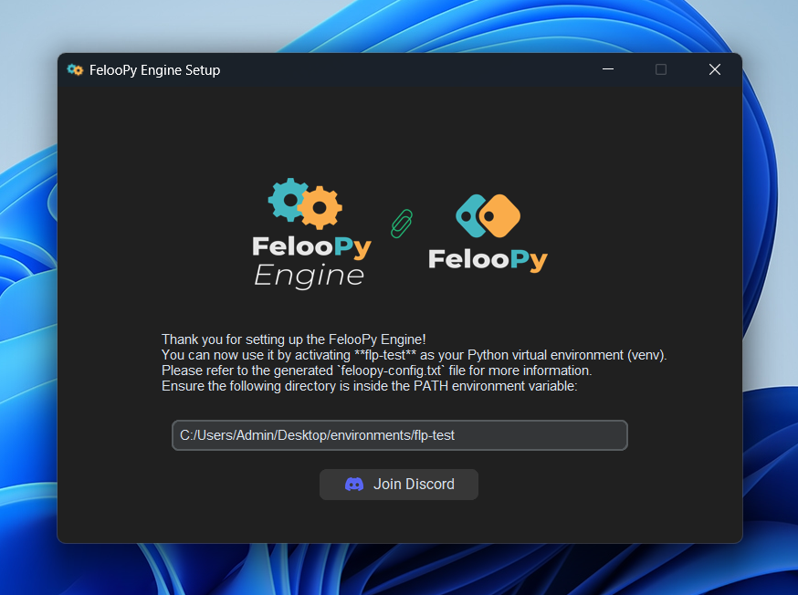

  

    <a href="https://feloopy.github.io" target="_blank">
      <picture>
        <source media="(prefers-color-scheme: light)" srcset="https://github.com/feloopy/engine/raw/main/repo/assets/feloopy-engine-logo-light.png">
        <source media="(prefers-color-scheme: dark)"  srcset="https://github.com/feloopy/engine/raw/main/repo/assets/feloopy-engine-logo-dark.png">
        
      </picture>
    </a>
  

  <strong>Enhanced FelooPy installation and management experience</strong>

 
 

  

 

 

 <b> Why the "Windows Protected Your PC" Warning Appears and a Quick Fix </b> 

 

Since FelooPy Engine is currently built using PyInstaller, which packages Python files into an executable, Windows Defender or SmartScreen may show a "Windows Protected Your PC" warning. This occurs because Windows 10 and above now treats unsigned or unfamiliar applications—especially new ones—as potential risks, even if the app is safe to run. You might refer to [Pyinstaller's official repository](https://github.com/pyinstaller/pyinstaller/issues) for more information.

To bypass the "false-positive" warning, click "More info" and then select "Run anyway," as shown in the images below:

  

  

 
 

#### Usage
The next frame will display the user agreement page:

  

Next, you will see the installation mode page. If you are installing Python and FelooPy for the first time, the easy install method may be suitable. Otherwise, please use the advanced install mode.

  

In the following frame, you will have two options: use an existing python.exe file on your system or download and install a new Python version, which you can select from available versions or enter manually. The default installation directory for Python can be changed if needed.

  

Next, you will choose between using an existing virtual environment or creating a new one. If you have a virtual environment folder (e.g., flp-310), select that directory and enter the folder name. If not, create a new virtual environment in your preferred directory with your chosen name.

  

Then, select the version of the FelooPy package to install, along with its variant. Optional features allow you to install additional packages from PyPI, enabling integration with some commercial or extra packages.

  

On the following page, you’ll get an overview of the actions that will be taken, along with notes and information on commands and directories.

  

The installation progress will then begin. This process may take some time, depending on your internet speed and system specifications.

  

Once the process is complete, you'll receive additional information and the path to the virtual environment where FelooPy is installed. Ensure that this path is included in your PATH environment variable. If not, you may need to rerun the process with administrator rights or do it manually.

  

Thank you for using and supporting FelooPy!