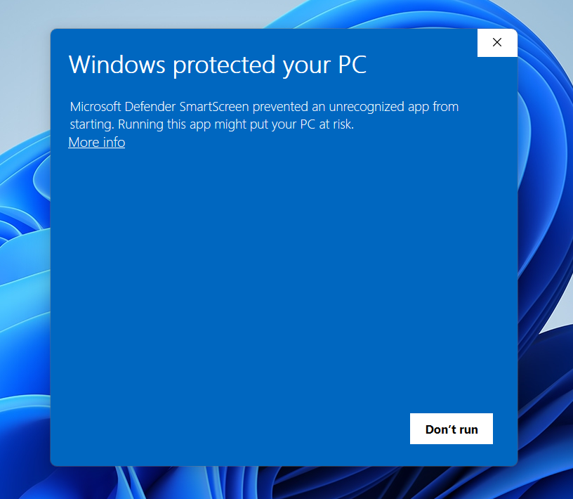
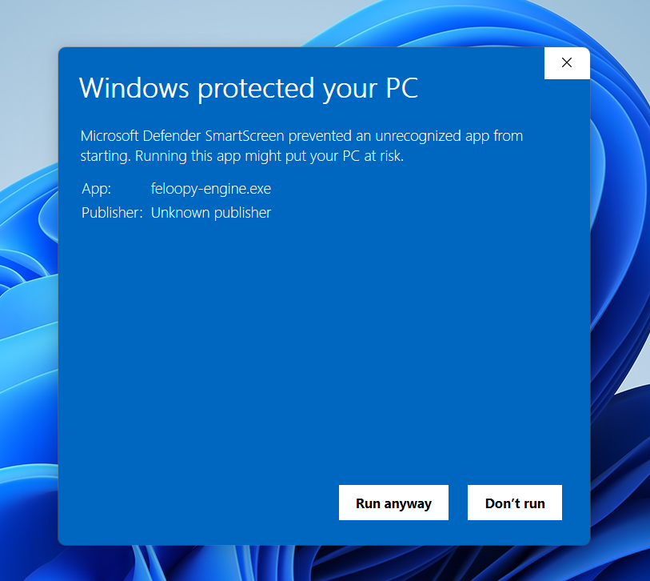

  

    <a href="https://feloopy.github.io" target="_blank">
      <picture>
        <source media="(prefers-color-scheme: light)" srcset="https://github.com/feloopy/engine/raw/main/repo/assets/feloopy-engine-logo-light.png">
        <source media="(prefers-color-scheme: dark)"  srcset="https://github.com/feloopy/engine/raw/main/repo/assets/feloopy-engine-logo-dark.png">
        
      </picture>
    </a>
  

  <strong>Enhanced FelooPy installation and management experience</strong>

 
 

  

 

 

 Why the "Windows Protected Your PC" Warning Appears and a Quick Fix 

 

Since FelooPy Engine is currently built using PyInstaller, which packages Python files into an executable, Windows Defender or SmartScreen may show a "Windows Protected Your PC" warning. This occurs because the executable is currently digitally unsigned, and Windows treats unsigned or unfamiliar applications—especially new ones—as potential risks, even if the app is safe to run. You might refer to [Pyinstaller's official repository](https://github.com/pyinstaller/pyinstaller/issues) for more information.

To bypass the "false-positive" warning, click "More info" and then select "Run anyway," as shown in the images below:

  

  

