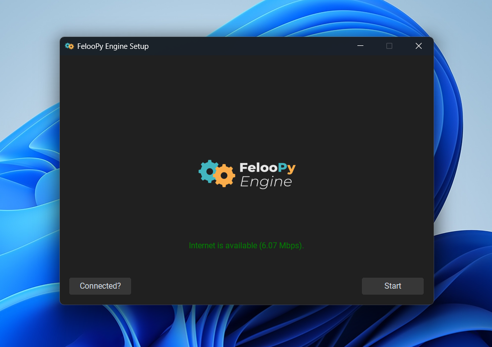

  

    <a href="https://feloopy.github.io" target="_blank">
      <picture>
        <source media="(prefers-color-scheme: light)" srcset="https://github.com/feloopy/engine/raw/main/repo/assets/feloopy-engine-logo-light.png">
        <source media="(prefers-color-scheme: dark)"  srcset="https://github.com/feloopy/engine/raw/main/repo/assets/feloopy-engine-logo-dark.png">
        
      </picture>
    </a>
  

  <strong>Enhanced FelooPy installation and management experience</strong>

